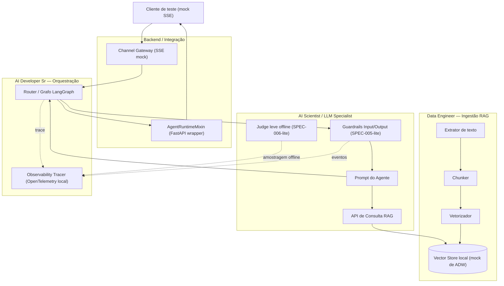
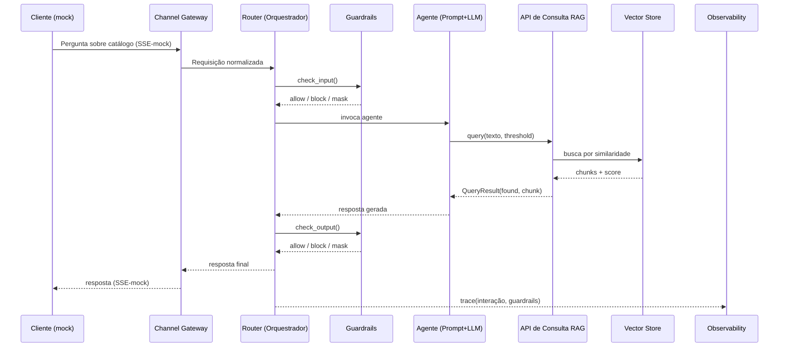

# Arquitetura da PoC

## Visão geral

A PoC reproduz, em escala reduzida e 100% local, os componentes centrais que
o Escopo Técnico v1.2 e os designs já produzidos (`orquestrador-central-skeleton`,
`pipeline-rag-base`, `matriz-guardrails`) esperam do `agent_platform_oci` no
projeto real. Cada bloco abaixo é de responsabilidade de um papel do time —
ver `PAPEIS-E-ENTREGAVEIS.md` para o detalhamento de entregas.



Fonte editável: [`diagrams/arquitetura-poc.mmd`](diagrams/arquitetura-poc.mmd).

## Mapeamento para as SPECs do `agent_platform_oci`

A tabela abaixo replica o exercício já feito em
`relatorio-aderencia-agent-platform-oci.md` (§3.1), mas agora ao nível dos
componentes que esta PoC efetivamente implementa — é o que a PoC valida na
prática.

| Componente da PoC | Equivalente no framework real | O que a PoC simplifica |
|---|---|---|
| Router / Grafo LangGraph | Enterprise Router / Supervisor (LangGraph workflow) | Sem roteamento entre múltiplas jornadas — só um único fluxo de consulta |
| Guardrails Input/Output | SPEC-005 (Guardrails) | Regras determinísticas simples (regex/lista) em vez do conjunto completo de classificadores de produção |
| `AgentRuntimeMixin` (via wrapper FastAPI) | SPEC-002 (Agent Runtime) | Implementação mínima que expõe a interface esperada, sem todas as capacidades de runtime de produção |
| Channel Gateway (mock SSE) | SPEC-009 (Channel Gateway) | Simula o contrato de entrada/saída, não implementa o contrato SSE/TIA real (aguardando "Adendo A", ver `integracao-sse-tia/spec.md`) |
| Observability Tracer | SPEC-007 (Observabilidade — Langfuse + OpenTelemetry + eventos IC/NOC/GRL) | OpenTelemetry local (console/arquivo), sem Langfuse gerenciado nem eventos IC/NOC/GRL reais |
| Judge leve offline | SPEC-006 (Evals) | Uma checagem simples por amostragem, não o Golden Standard Dataset completo (Deferred Idea em `STATE.md`) |
| Vector Store local (Chroma) | ADW (Autonomous Data Warehouse), `SESSION_REPOSITORY_PROVIDER=autonomous` | Mock local sem persistência gerenciada nem recursos corporativos do ADW |

## Fluxo de uma consulta (sequência)



Fonte editável: [`diagrams/sequencia-consulta.mmd`](diagrams/sequencia-consulta.mmd).

## Contratos de dados entre papéis

Estes são os contratos que cada papel deve respeitar para que a integração
do Checkpoint 1 (dia 5) funcione sem retrabalho — definidos no dia 1 do
cronograma (kickoff técnico).

### `QueryResult` (Data Engineer → AI Scientist)

```yaml
found: boolean
chunk_id: string | null
text: string | null
source_document_id: string | null
confidence_score: number
```

### `GuardrailResult` (AI Scientist → Orquestrador)

```yaml
guardrail_type: enum[input, output]
violation: enum[pii, competitor_mention, out_of_domain, none]
action_taken: enum[block, mask, allow]
```

### `Interaction` (Channel Gateway → Router)

```yaml
conversation_id: string
channel: enum[mock_sse]
message: string
timestamp: string
```

Esses três contratos seguem deliberadamente o mesmo vocabulário dos designs
já produzidos (`GuardrailResult`, `QueryResult` em
`pipeline-rag-base/design.md` e `orquestrador-central-skeleton/design.md`) —
qualquer aprendizado desta PoC sobre esses contratos é diretamente
reaproveitável no projeto real.

## Decisões técnicas (só as não óbvias)

| Decisão | Escolha | Racional |
|---|---|---|
| Vector store | Chroma local embutido (`PersistentClient`, sem servidor separado) | Não requer serviço externo nem credencial; papel equivalente ao ADW é só "banco vetorial consultável", que Chroma cobre para fins de PoC |
| Orquestração | LangGraph (mesma lib usada pelo `agent_platform_oci`) | Mantém a PoC no mesmo paradigma de grafo do framework real, não um substituto ad-hoc |
| Observabilidade | OpenTelemetry local, exportado para console/arquivo | Sem custo de infraestrutura gerenciada; formato de evento segue o mesmo schema de trace que SPEC-007 descreve |
| Empacotamento | `docker-compose` com um único serviço (`app`, o runtime FastAPI), sem Kubernetes/OKE | Escopo de 2 semanas não comporta infraestrutura de orquestração de containers — isso é decisão de "Ambientes e Acessos" do projeto real, não desta PoC |
