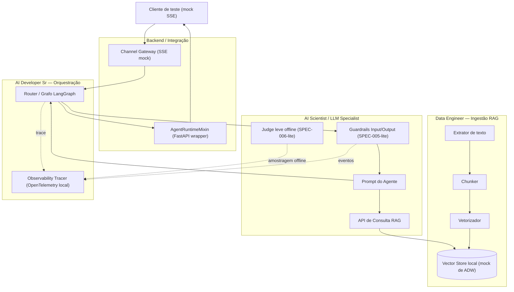
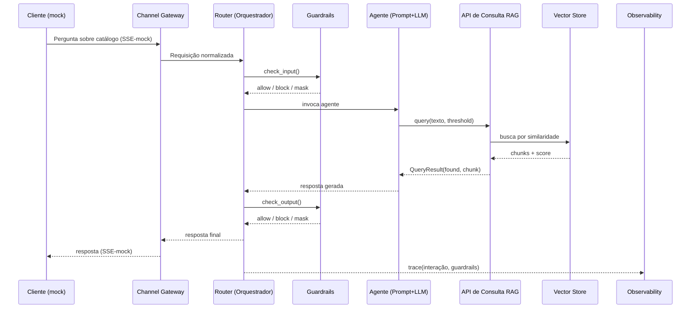

# Arquitetura da PoC

## Visão geral

A PoC reproduz, em escala reduzida e 100% local, os componentes centrais que
o Escopo Técnico v1.2 e os designs já produzidos no projeto principal
(resumos em
[`docs/referencias/orquestrador-central-skeleton-design-resumo.md`](referencias/orquestrador-central-skeleton-design-resumo.md),
[`docs/referencias/pipeline-rag-base-design-resumo.md`](referencias/pipeline-rag-base-design-resumo.md),
[`docs/referencias/matriz-guardrails-spec-resumo.md`](referencias/matriz-guardrails-spec-resumo.md))
esperam do `agent_platform_oci` no projeto real. Cada bloco abaixo é de
responsabilidade de um papel do time — ver `PAPEIS-E-ENTREGAVEIS.md` para o
detalhamento de entregas.



Fonte editável: [`diagrams/arquitetura-poc.mmd`](diagrams/arquitetura-poc.mmd).

## Mapeamento para as SPECs do `agent_platform_oci`

**Atualizado após integração real do framework (ver AD-007 em `STATE.md`):**
esta PoC agora depende de fato do pacote `agent_framework` (instalado via
`pip install` do subdiretório `libs/agent_framework` do repositório público
— ver `requirements.txt`), não apenas de bibliotecas genéricas usadas por
ele. A tabela abaixo mostra, por componente, se a PoC importa a classe/rail
real do framework ou mantém uma implementação própria — e por quê.

| Componente da PoC | Equivalente no framework real | Integração real ou implementação própria? |
|---|---|---|
| Router / Grafo LangGraph (`orchestrator/graph.py`) | Enterprise Router / Supervisor (LangGraph workflow) | Grafo próprio via `langgraph.graph.StateGraph` (mesma lib do framework) — sem roteamento entre múltiplas jornadas, só um único fluxo de consulta. O `AgentRuntimeMixin` real não documenta um padrão claro de integração via composição fora do template `agent_template_backend`, fora do escopo mínimo desta PoC |
| Guardrail de input — PII (`agent/guardrails/input_guardrail.py`) | `PiiMaskRail` (SPEC-005) | **Real** — importa `agent_framework.guardrails.PiiMaskRail` diretamente, não reimplementa regex de CPF |
| Guardrail de input — dados de terceiro | `OutOfScopeRail` (SPEC-005) | Checagem determinística própria — o `OutOfScopeRail` real classifica escopo de contas/faturas TIM via LLM, fora do escopo mínimo do Agente de Catálogo |
| Guardrail de output — concorrente (`agent/guardrails/output_guardrail.py`) | Nenhum rail equivalente no framework real | Checagem determinística própria — o framework não tem um rail de "menção a concorrente"; os rails de output reais (`ComplianceRail`, `ProactiveOfferRail`, `OutputPiiMaskRail`) cobrem outros escopos |
| LLM Client (`agent/llm_client.py`) | `create_llm()` / `LLMProvider` (`agent_framework.llm.providers`) | **Real** — usa o factory real do framework, com `LLM_PROVIDER=mock` (sem credencial de nuvem) por padrão |
| Channel Gateway (`gateway/channel_gateway.py`, `gateway/models.py`) | `ChannelMessage`/`ChannelResponse` (SPEC-009) | **Real** — `Interaction` é um alias de `agent_framework.channels.base.ChannelMessage`, não um dataclass próprio |
| Observability Tracer (`orchestrator/tracer.py`) | `OpenTelemetryProvider` (SPEC-007 — Langfuse + OpenTelemetry + eventos IC/NOC/GRL) | **Real** (parcial) — usa `agent_framework.observability.otel.OpenTelemetryProvider`; sem Langfuse gerenciado nem eventos IC/NOC/GRL (fora do escopo mínimo) |
| Judge leve offline (`agent/judge.py`) | SPEC-006 (Evals) | Implementação própria — checagem simples por amostragem, não o Golden Standard Dataset completo (Deferred Idea em `STATE.md`) |
| Vector Store (`rag_pipeline/vectorizer.py`) | `SQLiteVectorStore` (`agent_framework.rag.vector_store`) | **Não integrado deliberadamente** — `SQLiteVectorStore.add_texts()` sempre gera novo id (`uuid4`), sem upsert por chave externa estável, incompatível com o requisito de reingestão idempotente por `chunk_id` desta PoC. Mantido Chroma local, que suporta upsert nativo por id |

**Achado desta PoC (ver `docs/referencias/relatorio-aderencia-agent-platform-oci-resumo.md`):**
o framework real expõe rails de guardrail prontos e testáveis (`PiiMaskRail`,
`OutOfScopeRail`, `ComplianceRail`, etc. em `agent_framework.guardrails`) e
um `AgentRuntimeMixin` real (`agent_framework.runtime`) — mas nenhum exemplo
de composição/herança do runtime aparece fora do template
`agent_template_backend` (fora do escopo desta PoC), e o vector store nativo
tem uma lacuna de API (sem upsert por chave estável) que não estava prevista
na análise documental original.

## Fluxo de uma consulta (sequência)



Fonte editável: [`diagrams/sequencia-consulta.mmd`](diagrams/sequencia-consulta.mmd).

## Contratos de dados entre papéis

Estes são os contratos que cada papel deve respeitar para que a integração
do Checkpoint 1 (dia 5) funcione sem retrabalho — definidos no dia 1 do
cronograma (kickoff técnico). Ver
[`docs/referencias/pipeline-rag-base-design-resumo.md`](referencias/pipeline-rag-base-design-resumo.md)
e
[`docs/referencias/orquestrador-central-skeleton-design-resumo.md`](referencias/orquestrador-central-skeleton-design-resumo.md)
para os contratos completos do projeto principal, dos quais os desta PoC são
um subconjunto simplificado.

### `QueryResult` (Data Engineer → AI Scientist)

```yaml
found: boolean
chunk_id: string | null
text: string | null
source_document_id: string | null
confidence_score: number
```

### `GuardrailResult` (AI Scientist → Orquestrador)

```yaml
guardrail_type: enum[input, output]
violation: enum[pii, competitor_mention, out_of_domain, none]
action_taken: enum[block, mask, allow]
```

### `Interaction` (Channel Gateway → Router)

`Interaction` é um alias de `ChannelMessage`, contrato real de
`agent_framework.channels.base` (não um dataclass próprio desta PoC — ver
`gateway/models.py`):

```yaml
channel: string          # "mock_sse" nesta PoC
channel_id: string | null
session_id: string | null   # faz o papel de conversation_id nesta PoC
user_id: string | null
text: string
context: dict
```

`GuardrailResult` e `QueryResult` seguem deliberadamente o mesmo vocabulário
dos designs já produzidos no projeto principal — qualquer aprendizado desta
PoC sobre esses contratos é diretamente reaproveitável no projeto real.
`Interaction`/`ChannelMessage` já é, ele próprio, o contrato real do
framework (não uma aproximação).

## Decisões técnicas (só as não óbvias)

| Decisão | Escolha | Racional |
|---|---|---|
| Dependência do framework | `agent-framework` instalado via `pip install git+.../agent_platform_oci.git#subdirectory=libs/agent_framework` (ver `requirements.txt`) | Integração real, não apenas bibliotecas genéricas usadas pelo framework — resolve o gap CRITICO identificado no judge panel multi-modelo de 2026-08-07 (ver `STATE.md`, AD-008) |
| LLM | `agent_framework.llm.providers.create_llm()` com `LLM_PROVIDER=mock` (sem credencial de nuvem) | Usa o factory real do framework em vez de um cliente OpenAI próprio; `mock` resolve a dependência de credencial sem inventar infraestrutura |
| Guardrail de PII | `agent_framework.guardrails.PiiMaskRail` real | Evita reimplementar regex de CPF já calibrado no framework |
| Vector store | Chroma local embutido (`PersistentClient`, sem servidor separado) — **não** `agent_framework.rag.vector_store.SQLiteVectorStore` | `SQLiteVectorStore.add_texts()` sempre gera novo id, sem upsert por chave externa estável — incompatível com a reingestão idempotente por `chunk_id` que esta PoC exige. Chroma cobre esse requisito nativamente |
| Orquestração | LangGraph (mesma lib usada pelo `agent_platform_oci`, agora puxada como dependência transitiva do próprio `agent_framework`) | Mantém a PoC no mesmo paradigma de grafo do framework real, não um substituto ad-hoc |
| Observabilidade | `agent_framework.observability.otel.OpenTelemetryProvider` real, com `ENABLE_OTEL` controlando ativação | Usa o provider real do framework (no-op seguro quando desabilitado) em vez de montar OpenTelemetry solto |
| Empacotamento | `docker-compose` com um único serviço (`app`, o runtime FastAPI), sem Kubernetes/OKE | Escopo de 2 semanas não comporta infraestrutura de orquestração de containers — isso é decisão de "Ambientes e Acessos" do projeto real, não desta PoC |
