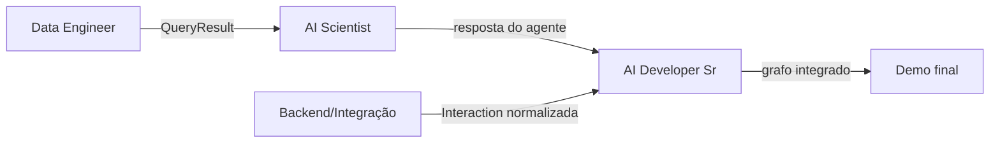

# Papéis e Entregáveis

Cada papel entrega uma fatia isolada e testável da arquitetura (ver
`ARQUITETURA.md`). As fatias se conectam pelos contratos de dados definidos
no dia 1 (kickoff) e formalizados em `ARQUITETURA.md`, seção "Contratos de
dados entre papéis" — nenhum papel deve começar a codificar antes desses
contratos estarem acordados.

---

## Data Engineer — Ingestão RAG

**Entrega:** pipeline de ingestão completo, documentado em `INGESTAO.md`.

| Módulo | Arquivo | Responsabilidade |
|---|---|---|
| Extrator | `rag_pipeline/extractor.py` | Ler `.md` sintético, separar front-matter de corpo |
| Chunker | `rag_pipeline/chunker.py` | Fragmentar por header Markdown |
| Enriquecedor | `rag_pipeline/metadata_enricher.py` | Anexar metadados do front-matter a cada chunk |
| Vetorizador | `rag_pipeline/vectorizer.py` | Gerar embedding e persistir no Chroma local |
| API de Consulta | `rag_pipeline/query_api.py` | Expor `query(text, threshold) -> QueryResult` |
| Script de ingestão | `scripts/run_ingestao.py` | CLI que roda o pipeline completo sobre `data/catalogo/` |
| Dados sintéticos | `data/catalogo/*.md` | 8-12 documentos fictícios de plano/oferta (autoria do Data Engineer) |
| Testes | `tests/test_ingestao.py` | Cobertura descrita em `INGESTAO.md`, seção 8 |

**Não é responsabilidade deste papel:** o prompt do agente, a lógica de
guardrail, ou como a resposta final é formatada — apenas entregar dados
consultáveis e um `QueryResult` confiável.

**Marco de saída:** `python scripts/run_ingestao.py` roda sem erro e
`query_api.query("franquia do plano turbo")` retorna um chunk relevante com
`found: true`.

---

## AI Scientist / LLM Specialist

**Entrega:** o agente propriamente dito — prompt, guardrails de input/output,
e um judge leve offline.

| Módulo | Arquivo | Responsabilidade |
|---|---|---|
| Prompt do agente | `agent/prompt.py` | Template de prompt que injeta o `QueryResult` como contexto, instrui o modelo a nunca responder sem evidência (`found: false` → resposta padrão "não encontrei essa informação") |
| Guardrail de input | `agent/guardrails/input_guardrail.py` | Mascarar PII (CPF, cartão) e bloquear pedidos fora de domínio, antes de chamar o LLM |
| Guardrail de output | `agent/guardrails/output_guardrail.py` | Bloquear citação direta de concorrente por nome na resposta gerada |
| Judge leve offline | `agent/judge.py` | Script que roda sobre um lote de interações já registradas e sinaliza respostas sem `source_document_id` (possível alucinação) |
| Testes | `tests/test_agent.py` | Casos de guardrail (PII mascarado, concorrente bloqueado) e casos de resposta fundamentada (fonte citada corretamente) |

**Não é responsabilidade deste papel:** como a requisição chega até o agente
(isso é do Backend/Integração) nem como o agente é orquestrado entre nós do
grafo (isso é do AI Developer Sr) — apenas a qualidade e segurança da
resposta gerada, dado um `QueryResult` já pronto.

**Marco de saída:** dado um `QueryResult` de teste com `found: true`, o
agente gera uma resposta que cita a fonte; dado um input com CPF, o
guardrail mascara antes de qualquer chamada ao LLM; dado um output simulado
citando concorrente, o guardrail de saída bloqueia.

---

## Backend / Integração

**Entrega:** a camada de runtime que expõe o agente como serviço HTTP e
simula o contrato de canal.

| Módulo | Arquivo | Responsabilidade |
|---|---|---|
| Channel Gateway (mock SSE) | `gateway/channel_gateway.py` | Normaliza uma requisição de teste para o formato `Interaction` (ver `ARQUITETURA.md`) — simula, sem implementar de fato, o formato do contrato SSE/TIA |
| Runtime FastAPI | `gateway/app.py` | Expõe `POST /agent/interact`, delegando para o orquestrador; wrapper mínimo equivalente a `AgentRuntimeMixin` |
| Health check | `gateway/health.py` | Endpoint `GET /health` |
| Pipeline CI | `bitbucket-pipelines.yml` | Lint (`ruff`/`flake8`) + testes (`pytest`) + build da imagem Docker a cada push |
| Testes | `tests/test_gateway.py` | Requisição válida retorna 200 com corpo esperado; requisição malformada retorna 400 explícito |

**Não é responsabilidade deste papel:** a lógica de negócio do agente nem o
grafo de orquestração — apenas garantir que uma requisição HTTP chega
corretamente até o orquestrador e a resposta volta no formato esperado.

**Marco de saída:** `docker compose up` sobe o serviço FastAPI, e
`curl -X POST localhost:8000/agent/interact -d '{"message": "..."}'` retorna
uma resposta HTTP válida.

---

## AI Developer Sr — Orquestração e integração final

**Entrega:** o grafo que liga ingestão + agente + guardrails + gateway, mais
observabilidade, e é o dono técnico da integração ponta a ponta.

| Módulo | Arquivo | Responsabilidade |
|---|---|---|
| Router / Grafo | `orchestrator/graph.py` | Grafo LangGraph que orquestra: recebe `Interaction` do gateway → aciona guardrail de input → aciona agente → aciona guardrail de output → retorna resposta |
| Observability Tracer | `orchestrator/tracer.py` | Registra, via OpenTelemetry local, cada interação (latência por etapa, guardrails acionados, chunk usado) |
| Script de demo | `scripts/run_demo.py` | Roda as 5 perguntas de `CRITERIOS-DE-ACEITE.md` e imprime o resultado formatado |
| `docker-compose.yml` | raiz do repo | Sobe Chroma + serviço FastAPI + qualquer dependência local necessária |
| Testes de integração | `tests/test_integracao.py` | Roda o fluxo completo (ingestão já feita → pergunta → resposta) para as 5 perguntas de `CRITERIOS-DE-ACEITE.md` |

**Responsabilidade adicional:** este papel é quem resolve conflitos de
contrato entre os outros três papéis durante a integração (Checkpoints 1 e
2 do cronograma) — não porque tenha mais autoridade, mas porque é quem
monta o grafo que os une, então é o primeiro a notar uma incompatibilidade.

**Marco de saída:** `python scripts/run_demo.py` roda as 5 perguntas do
critério de aceite e produz saída correta para todas, com trace de
observabilidade visível no console/arquivo.

---

## Dependências entre papéis (ordem prática, não hierarquia)

Na prática: Data Engineer e Backend/Integração podem trabalhar em paralelo
desde o dia 1 (nenhum depende do outro). AI Scientist depende do contrato
`QueryResult` (mas pode começar o prompt/guardrails com um mock antes da
ingestão real estar pronta). AI Developer Sr integra tudo a partir do
Checkpoint 1 (dia 5) — antes disso, prepara o esqueleto do grafo com stubs.
